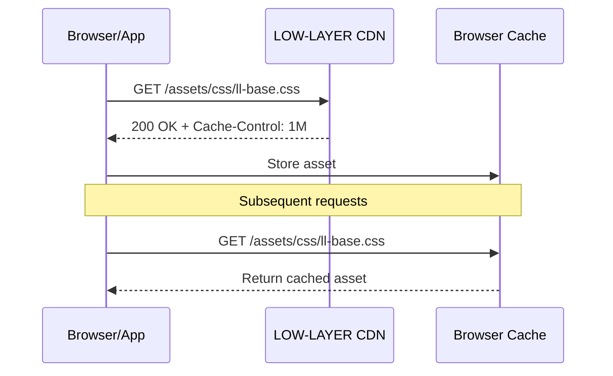

# LOW-LAYER CDN

[](https://nginx.org/)
[](https://www.docker.com/)
[](https://developer.mozilla.org/en-US/docs/Web/CSS)

[](LICENSE)
[](https://github.com/Astocanthus/low-layer-cdn/releases/latest)
[](https://github.com/Astocanthus/low-layer-cdn/issues)

Static asset CDN for the LOW-LAYER SaaS ecosystem, serving reusable CSS design system components and 3D model assets.

This CDN provides a centralized distribution point for shared frontend resources across all LOW-LAYER projects, ensuring consistent styling and optimized asset delivery.

---

## Features

- **CSS Design System**: Complete sci-fi themed component library with glassmorphism, neon effects, and angular designs.
- **3D Model Assets**: GLB format character models for avatars (male, female, special variants).
- **CORS Enabled**: Full cross-origin support for integration across multiple domains.
- **Aggressive Caching**: 1-month cache headers for optimal performance.
- **Health Endpoints**: Kubernetes-ready liveness probes at `/health`.
- **Rootless Container**: Runs as non-root nginx user for enhanced security.

---

## Project Structure

```
low-layer-cdn/
├── Dockerfile                  # Nginx Alpine container build
├── docker-compose.yml          # Container orchestration
├── nginx.conf                  # Server configuration with CORS
├── LICENSE                     # MIT License
└── assets/
    ├── css/
    │   ├── ll-base.css         # Variables, reset, typography, layers
    │   ├── ll-animations.css   # Keyframes and animation utilities
    │   ├── ll-components.css   # UI components (buttons, cards, forms)
    │   └── ll-utils.css        # Utility classes (flex, spacing, etc.)
    └── models/
        ├── female-01.glb       # Female avatar variant 1
        ├── female-02.glb       # Female avatar variant 2
        ├── female-03.glb       # Female avatar variant 3
        ├── female-04.glb       # Female avatar variant 4
        ├── male-01.glb         # Male avatar variant 1
        ├── male-02.glb         # Male avatar variant 2
        ├── male-03.glb         # Male avatar variant 3
        ├── male-04.glb         # Male avatar variant 4
        ├── special-01.glb      # Special avatar variant 1
        ├── special-02.glb      # Special avatar variant 2
        ├── special-03.glb      # Special avatar variant 3
        └── special-04.glb      # Special avatar variant 4
```

---

## Architecture

### Asset Delivery Flow



---

## Quick Start

### Prerequisites

- **Docker**: Version 20.10+ with Docker Compose.
- **Network Access**: Port 9090 available on host.

### Installation

```bash
# Clone the repository
git clone git@github.com:Astocanthus/low-layer-cdn.git
cd low-layer-cdn

# Build and start the container
docker compose up -d --build

# Verify the service is running
curl http://localhost:9090/health
```

### Docker Compose

```yaml
services:
  cdn:
    build: .
    container_name: low-layer-cdn
    restart: unless-stopped
    security_opt:
      - no-new-privileges:true
    ports:
      - "9090:8080"
    networks:
      - cdn-network

networks:
  cdn-network:
    driver: bridge
```

---

## Configuration

### Environment Variables

| Variable | Description | Required | Default |
|----------|-------------|----------|---------|
| N/A | No environment variables required | — | — |

### Port Mapping

| Internal Port | External Port | Description |
|---------------|---------------|-------------|
| 8080 | 9090 | HTTP traffic |

### CORS Configuration

The CDN allows cross-origin requests from any domain:

| Header | Value |
|--------|-------|
| `Access-Control-Allow-Origin` | `*` |
| `Access-Control-Allow-Methods` | `GET, OPTIONS` |
| `Access-Control-Allow-Headers` | `DNT, User-Agent, X-Requested-With, If-Modified-Since, Cache-Control, Content-Type, Range` |

---

## CSS Design System

### File Overview

| File | Size | Description |
|------|------|-------------|
| `ll-base.css` | ~6KB | CSS variables, reset, typography, layer system |
| `ll-animations.css` | ~3KB | Keyframes, animation classes, reduced-motion support |
| `ll-components.css` | ~25KB | Complete UI component library |
| `ll-utils.css` | ~4KB | Utility classes for layout and spacing |

### Usage in Projects

```html
<!-- Load the complete design system -->
<link rel="stylesheet" href="https://cdn.low-layer.com/assets/css/ll-base.css">
<link rel="stylesheet" href="https://cdn.low-layer.com/assets/css/ll-animations.css">
<link rel="stylesheet" href="https://cdn.low-layer.com/assets/css/ll-components.css">
<link rel="stylesheet" href="https://cdn.low-layer.com/assets/css/ll-utils.css">
```

### Theming

Override the primary hue to change the entire color scheme:

```css
:root {
    --ll-hue: 280;        /* Purple theme */
    --ll-hue-secondary: 60; /* Yellow accents */
}
```

### Component Examples

```html
<!-- Glass Card -->
<div class="ll-glass ll-glass--crt ll-p-6">
    <h2 class="ll-section-title">Welcome</h2>
</div>

<!-- Primary Button -->
<button class="ll-btn ll-btn--primary">
    <span class="ll-btn__text">INITIALIZE</span>
</button>

<!-- Status Badge -->
<div class="ll-status ll-status--online">
    <span class="ll-status__dot"></span>
    <span>ONLINE</span>
</div>
```

---

## API Endpoints

### Assets (`/assets/`)

| Endpoint | Method | Description |
|----------|--------|-------------|
| `/assets/css/*.css` | GET | CSS stylesheets |
| `/assets/models/*.glb` | GET | 3D model files |

### Health (`/health`)

| Endpoint | Method | Description |
|----------|--------|-------------|
| `/health` | GET | Liveness probe (returns 200) |

---

## Health Check Endpoints

| Endpoint | Type | Status Codes | Description |
|----------|------|--------------|-------------|
| `/health` | Liveness | 200 | Nginx process is running |

### Kubernetes Probe Configuration

```yaml
livenessProbe:
  httpGet:
    path: /health
    port: 8080
  initialDelaySeconds: 5
  periodSeconds: 10
```

---

## Development

### Local Setup

```bash
# Build the container
docker compose build

# Start with logs
docker compose up

# Rebuild after asset changes
docker compose up -d --build
```

### Adding New Assets

1. Place CSS files in `assets/css/`
2. Place 3D models in `assets/models/`
3. Rebuild the container: `docker compose up -d --build`

### Testing Asset Delivery

```bash
# Test CSS delivery
curl -I http://localhost:9090/assets/css/ll-base.css

# Test CORS headers
curl -I -H "Origin: https://example.com" http://localhost:9090/assets/css/ll-base.css

# Test health endpoint
curl http://localhost:9090/health
```

---

## Troubleshooting

### "Permission denied" errors in container

**Cause**: Nginx cannot write to cache or log directories.

**Solution**: The Dockerfile already handles this by setting proper ownership before switching to the nginx user. If rebuilding:

```bash
docker compose down
docker compose build --no-cache
docker compose up -d
```

### Assets not updating after changes

**Cause**: Browser cache or Docker layer cache.

**Solution**:

```bash
# Force rebuild without cache
docker compose build --no-cache
docker compose up -d

# Clear browser cache or use incognito mode
```

### CORS errors in browser console

**Cause**: Request headers not matching allowed list.

**Solution**: Check the nginx.conf CORS configuration. The current setup allows all origins (`*`).

---

## License

This project is open source and available under the [MIT License](LICENSE).

---

## Author

**LOW-LAYER Team** - Infrastructure & Frontend

- GitHub: [@Astocanthus](https://github.com/Astocanthus)
- Contact: contact@low-layer.com

---

## Acknowledgments

- Built for the LOW-LAYER SaaS ecosystem
- Powered by [Nginx](https://nginx.org/) and [Docker](https://www.docker.com/)
